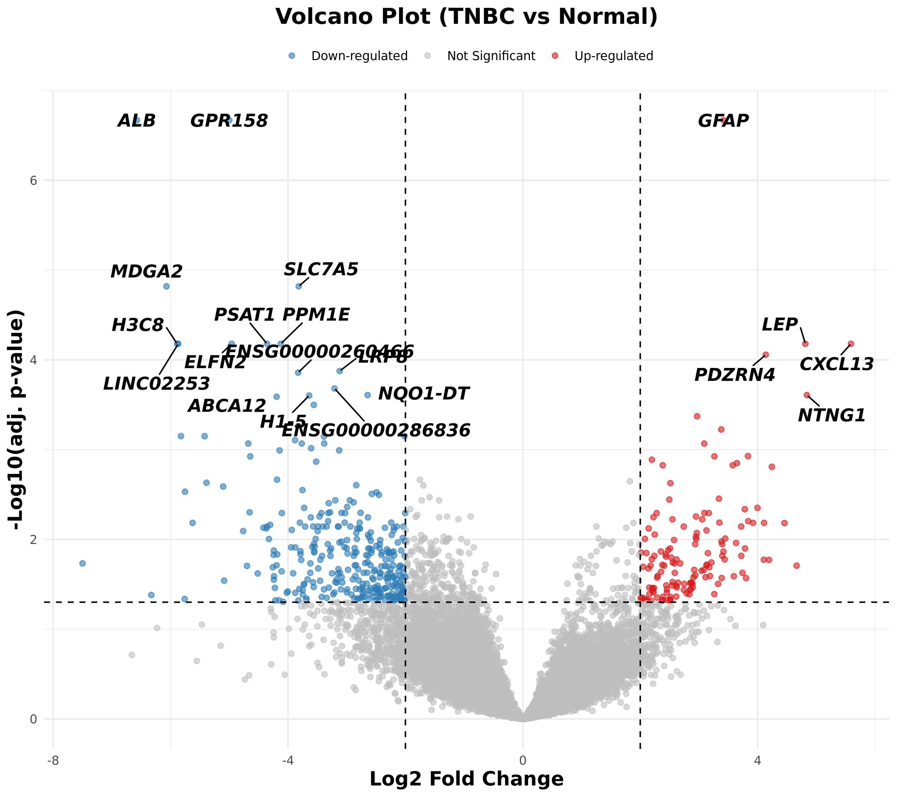
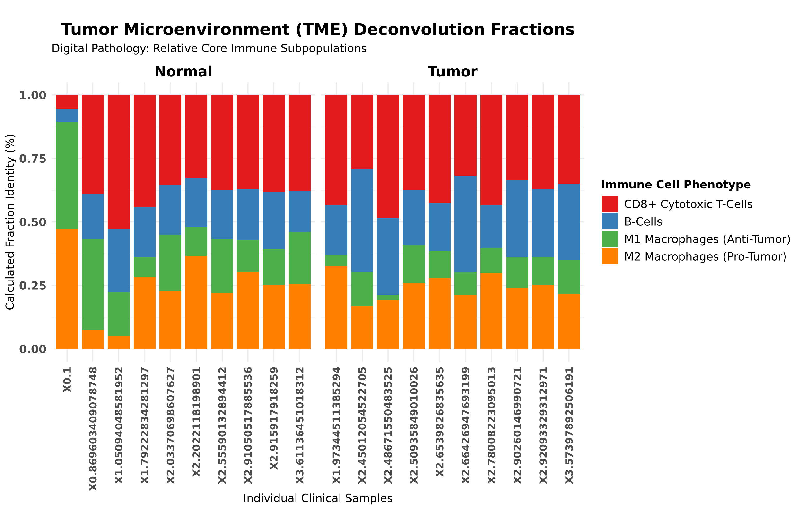
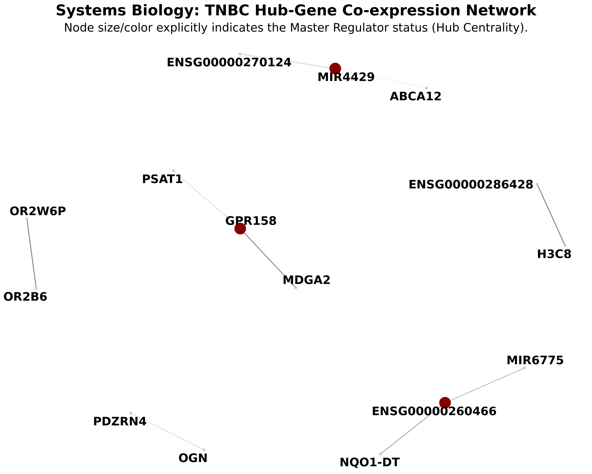

# 🧬 Transcriptomic Pipelines and TNBC Carcinoma Characterization

[]()
[]()
[]()
[](https://opensource.org/licenses/MIT)

> 📢 **Manuscript Status:** The primary findings of this repository are currently **Under Review at PLOS ONE** (Submitted: May 2026).
> *Title: Integrative Transcriptomic Profiling of the Tumor Microenvironment and Identification of Prognostic Biomarkers in Triple-Negative Breast Cancer*

## 📌 Overview

This repository integrates high-throughput sequencing pipelines and specialized transcriptomic characterization workflows. The primary focus is the molecular profiling of **Triple-Negative Breast Cancer (TNBC)**, utilizing differential expression analysis (DESeq2), tumor microenvironment (TME) deconvolution, and systems biology network mapping.

---

## 🔬 Core Findings & Visualizations (Module 4)

Our transcriptomic analysis pipeline yielded significant insights into the TNBC microenvironment. Below are key visual outputs generated from the analyzed datasets (e.g., GSE142731).

### 1. Differential Expression & Immune Hot Phenotypes
Identification of significantly upregulated immune-related genes (e.g., CXCL13, PDCD1) in TNBC compared to normal tissue.

<p align="center">
  
</p>

### 2. Tumor Microenvironment (TME) Deconvolution
Quantification of infiltrating immune cell populations within the tumor microenvironment.

<p align="center">
  
</p>

### 3. Systems Biology Network
Co-expression network mapping highlighting hub genes and regulatory interactions (e.g., PI3K-Akt signaling hyperactivation).

<p align="center">
  
</p>

---

## 🗂️ Technical Inventory and Architecture

### 1. TNBC Research Manuscript ([`module_4_tnbc_paper/`](./module_4_tnbc_paper/))
Contains primary research manuscript drafts (`.docx`, `.pdf`), high-resolution figures, and the final zipped submission for PLOS ONE.

### 2. End-to-End RNA-Seq Pipeline ([`SRA+QC+.../`](./SRA+QC+Trimmed+Indexing+Align+Counts+DE+Pathway/))
A systematic, shell-driven environment for raw data processing.
- **`setup_rna_seq.sh`**: Automated environment and directory configuration.
- Includes pre-processing modules: SRA downloading, FastQC validation, read trimming (Trimmomatic), and alignment (HISAT2).

### 3. Personal Clinical Genomics ([`MyHeritage/`](./MyHeritage/))
Python-based scripts (`analyze_dna.py`, `clinvar_annotator.py`) designed to annotate 609K personal SNPs against the NIH ClinVar database for pharmacogenomic interpretation.

### 4. Pathway Topology ([`Reactome/`](./Reactome/) & `DAVID/`)
Spatial mapping of molecular signaling pathways and functional enrichment outputs (GO/KEGG).

---

## ⚙️ Pipeline Implementation

### Environment and Dependencies
The project utilizes a dedicated Conda environment on an **AlmaLinux 9** server.
- **Mapping:** HISAT2 (GRCh38 Indexing)
- **Quantification:** Subread (`featureCounts`)
- **Differential Expression:** R / `DESeq2`
- **Machine Learning:** `scikit-learn` (PCA, Random Forest)

### Execution Trace
```bash
# 1. Initialize repository structure and raw data handling
bash SRA+QC+Trimmed+Indexing+Align+Counts+DE+Pathway/setup_rna_seq.sh

# 2. Run Differential Expression and Plotting (Module 4)
bash module_4_tnbc_paper/scripts/run_deseq.sh
```

---

## 🎓 Academic Context
This repository demonstrates an end-to-end capability in **Computational Biology**, transitioning from raw high-throughput sequencing data to publication-ready systems biology insights and clinical genomic interpretation.

---

**Author:** Suleiman Hajizadeh | Bioinformatician @ IMBB, Azerbaijan
📧 suleyman.hacizade1@gmail.com
