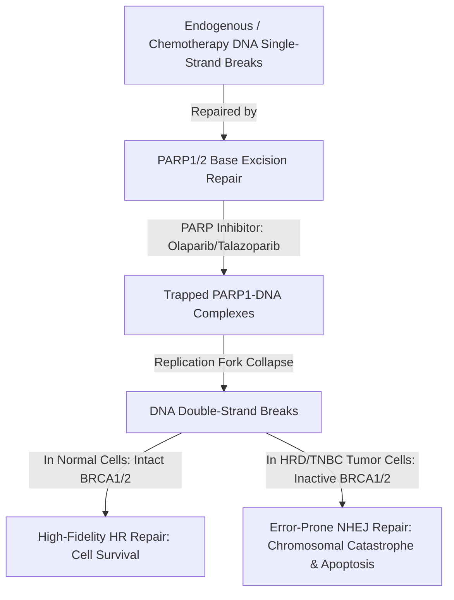

# Homologous Recombination Deficiency (HRD) and Synthetic Lethality

## Overview
**Homologous Recombination Deficiency (HRD)** occurs when cells lose the ability to accurately repair DNA double-strand breaks (DSBs) through the high-fidelity homologous recombination pathway, predominantly due to germline or somatic mutations in [[brca1-brca2]], *PALB2*, or *RAD51C*. HRD is present in approximately 50% of [[triple-negative-breast-cancer]] tumors.

## Synthetic Lethality Mechanism

## Genomic Biomarkers of HRD
1. **Loss of Heterozygosity (LOH)**: Chromosomal segments showing single parental allele loss.
2. **Telomeric Allelic Imbalance (TAI)**: Unequal parental contributions extending to telomeres.
3. **Large-Scale State Transitions (LST)**: Chromosomal breaks between adjacent regions $\ge 10\text{ Mb}$.
- Combined composite HRD score $\ge 42$ identifies patients responsive to platinum chemotherapy and PARP inhibitors.

## Related Concepts & Entities
- [[brca1-brca2]]
- [[triple-negative-breast-cancer]]
- [[tnbc-targeted-and-immune-therapeutics]]
- [[clinvar]]

## Citations & Sources
- [[tnbc-targeted-and-immune-therapeutics]]
