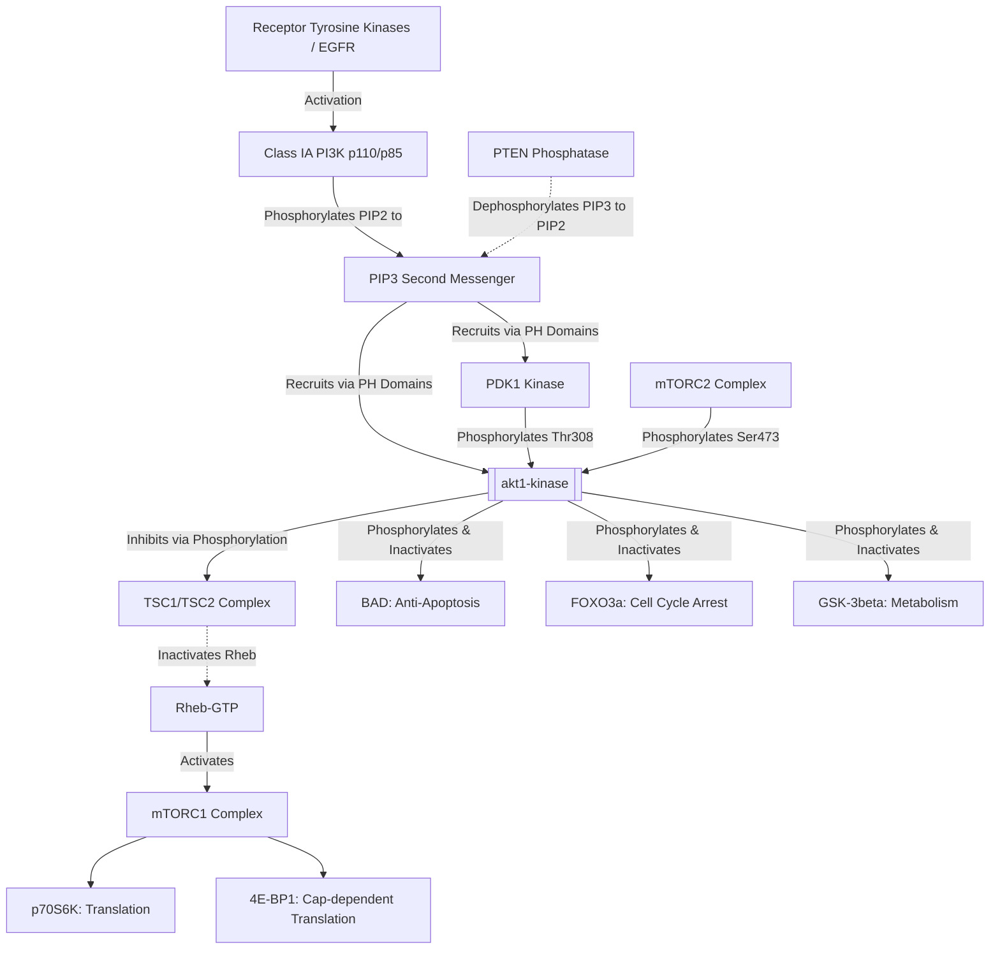

# PI3K-Akt-mTOR Signaling Axis in Oncology & Drug Resistance

## Overview
The **PI3K-Akt-mTOR pathway** is an intracellular signaling cascade critical for cell survival, nutrient sensing, proliferation, protein synthesis, and metabolic plasticity. In [[triple-negative-breast-cancer]], genetic lesions (*PIK3CA* activating mutations, *PTEN* loss-of-function, *INPP4B* downregulation) cause constitutive pathway hyperactivation, driving therapeutic chemoresistance.

## Molecular Cascade & Enzymatic Mechanism

## Therapeutic Targets & Inhibitor Classes
1. **Pan-AKT / Isoform-Selective Allosteric Inhibitors**: [[mk-2206]] binds the interface between the PH and kinase domains, preventing membrane recruitment.
2. **ATP-Competitive Orthosteric Inhibitors**: [[ipatasertib]] (GDC-0068) and Capivasertib (AZD5363) bind the catalytic cleft.
3. **Dual PI3K/mTOR Inhibitors**: Dactolisib (BEZ235), Gedatolisib.

## Related Concepts & Entities
- [[akt1-kinase]]
- [[mk-2206]]
- [[ipatasertib]]
- [[triple-negative-breast-cancer]]
- [[transcriptome-to-structure-drug-discovery]]

## Citations & Sources
- [[tnbc-akt1-alphafold-docking-manuscript]]
