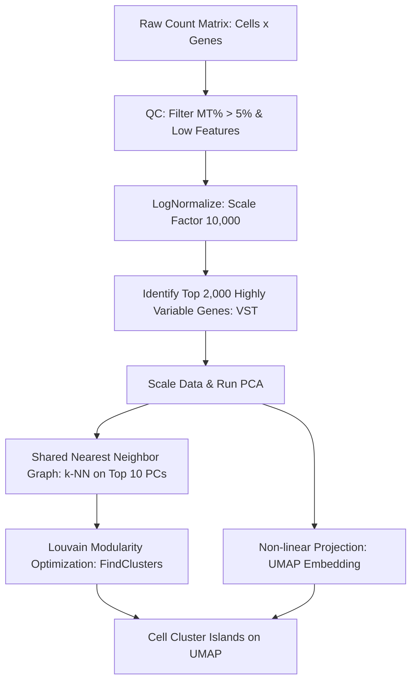

# Single-Cell RNA Sequencing Dimensionality Reduction & Graph Clustering

## Overview
Single-cell RNA sequencing (scRNA-seq) quantifies gene expression at individual cellular resolution. Due to extreme sparsity (dropouts) and high dimensionality (thousands of cells $\times$ tens of thousands of genes), analysis relies on sequential quality filtering, highly variable gene selection, linear dimensionality reduction (PCA), graph-based modularity clustering (Louvain/SLM), and non-linear manifold embeddings (UMAP/t-SNE).

## Core Procedural Steps

### 1. Cellular Quality Control
- **Low Feature Count**: Removes empty droplets or low-viability cells ($\text{nFeature} < 200$).
- **High Feature Count**: Eliminates doublets/multiplets ($\text{nFeature} > 2500$).
- **Mitochondrial Percentage**: Elevated MT expression ($> 5\%$) indicates compromised, dying, or lysed cell membranes.

### 2. Feature Selection & PCA
- Fits a local polynomial regression on variance-mean relationship to select the top 2,000 variable genes ($\text{selection.method} = \text{"vst"}$).
- PCA compresses technical noise into top orthogonal eigenvectors (typically dimensions 1–10).

### 3. Graph Clustering & UMAP
- **K-Nearest Neighbor (k-NN)** graph built from Euclidean distances in PCA space.
- **Louvain Community Detection** maximizes network modularity to identify discrete cell subtypes.
- **UMAP (Uniform Manifold Approximation and Projection)** projects high-dimensional graphs onto a 2D canvas while preserving both local and global manifold structure.

## Related Concepts & Entities
- [[seurat]]
- [[variance-stabilizing-transformation]]
- [[immune-deconvolution-tme]]

## Citations & Sources
- [[single-cell-seurat-workflow]]
