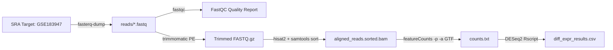

# Bulk RNA-Seq Snakemake Orchestration Pipeline

## Core Thesis / Executive Summary
A production-grade, reproducible workflow engine implemented in **Snakemake** to automate raw SRA download, paired-end adapter trimming, spliced alignment against reference genome GRCh38, and genomic feature count extraction, culminating in differential gene expression.

## Workflow Rules & Dependencies

## Key Methodological Parameters
- **Data Fetching**: `fasterq-dump --split-files` into temporary raw reads.
- **Trimming (`trimmomatic PE`)**: `ILLUMINACLIP:adapters.fa:2:30:10 LEADING:3 TRAILING:3 SLIDINGWINDOW:4:15 MINLEN:36` with Phred-33 quality scoring.
- **Alignment (`hisat2`)**: GRCh38 spliced indexing piped to `samtools sort` and indexed with `samtools index`.
- **Quantification (`featureCounts`)**: Paired-end mode (`-p`), 4 threads (`-T 4`), annotated via GRCh38 Ensembl/NCBI GTF.
- **Execution Script**: Handoff to `run_deseq2_analysis.R`.

## Touched Wiki Pages
- Entity: [[snakemake]]
- Entity: [[hisat2]]
- Entity: [[featurecounts]]
- Entity: [[deseq2]]
- Concept: [[negative-binomial-model]]
