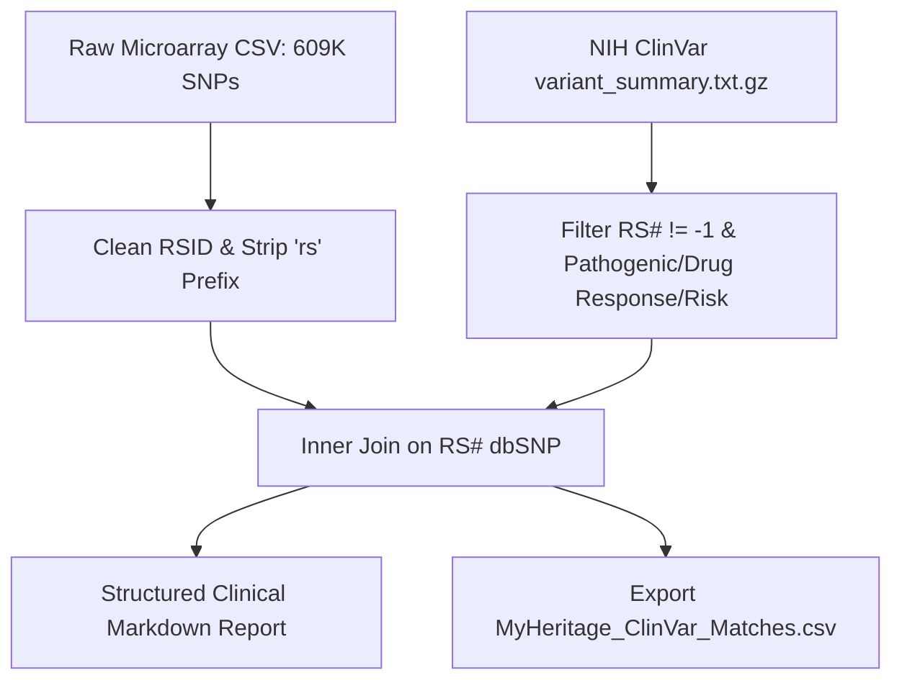

# Clinical Genomics & Personal SNP Microarray Annotation Pipeline

## Core Thesis / Executive Summary
A high-throughput Python analytics engine for translating raw personal SNP microarray genotypes (609K markers from MyHeritage array chips) into clinical and phenotypic insights:
1. **Curated Trait Assessment (`analyze_dna.py`)**: Fast hash-table matching of major behavioral, metabolic, and athletic polymorphisms (*ACTN3*, *MCM6*, *CYP1A2*, *COMT*, *DRD2*, *OPRM1*, *FTO*, *CCR5-Delta32*).
2. **Clinical Variant Annotation (`clinvar_annotator.py`)**: Automated ingestion and filtering of the NIH ClinVar `variant_summary.txt.gz` archive, inner join on dbSNP `RS#`, and extraction of pathogenic alleles, pharmacogenomic drug responses, and disease risk factors into structured Markdown reports and CSV files.

## Workflow Mechanics

## Touched Wiki Pages
- Concept: [[variant-pathogenicity-annotation]]
- Entity: [[clinvar]]
- Synthesis: [[multi-omics-analytical-ecosystem]]
