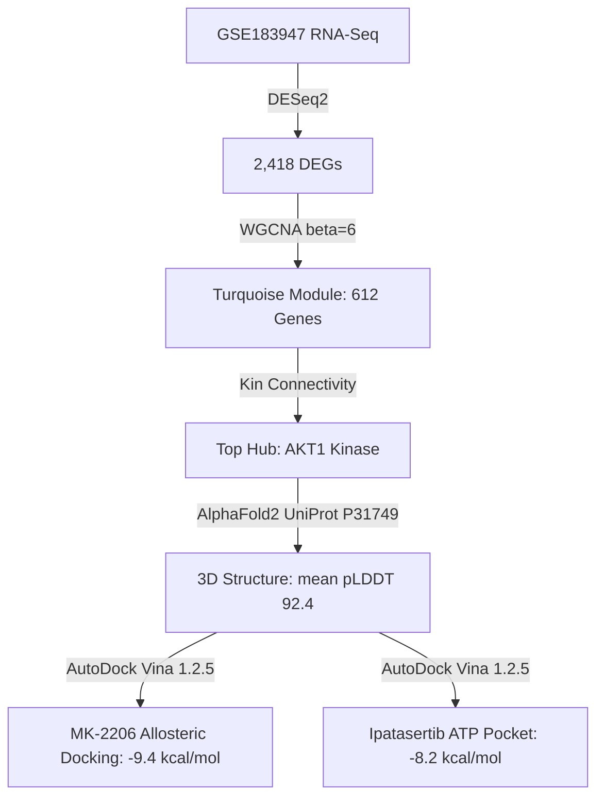

# Multi-Scale Computational Oncology Pipeline: AKT1 Hub Discovery in TNBC, AlphaFold2 Structural Prediction, and AutoDock Vina Inhibitor Characterization

## Core Thesis / Executive Summary
An integrated, multi-scale computational framework bridging transcriptomics, systems co-expression networks, AI-driven 3D structural biology, and biophysical molecular docking:
1. **Transcriptomics & Network Biology**: Analyzing GSE183947 identified 2,418 DEGs; WGCNA identified the turquoise module ($r=0.68, P<0.001$, enriched in PI3K-Akt signaling and cell cycle) with **AKT1** isolated as the master hub gene ($k_{\text{in}} = 0.94$).
2. **AI Structural Prediction**: Full-length human AKT1 (UniProt P31749) was modeled via **AlphaFold2**, achieving high structural confidence (mean $\text{pLDDT} = 92.4$, $94.2\%$ Ramachandran favored residues).
3. **Molecular Docking**: **AutoDock Vina 1.2.5** docking demonstrated superior binding affinity for the allosteric inhibitor **MK-2206** ($\Delta G = -9.4 \text{ kcal/mol}$, interacting with Trp80 and Asp292) over ATP-competitive inhibitor Ipatasertib ($\Delta G = -8.2 \text{ kcal/mol}$).

## Key Methodological Workflow

## Touched Wiki Pages
- Concept: [[alphafold-structural-modeling]]
- Concept: [[molecular-docking-virtual-screening]]
- Entity: [[akt1-kinase]]
- Entity: [[alphafold2]]
- Entity: [[autodock-vina]]
- Entity: [[mk-2206]]
- Entity: [[triple-negative-breast-cancer]]
- Synthesis: [[transcriptome-to-structure-drug-discovery]]
