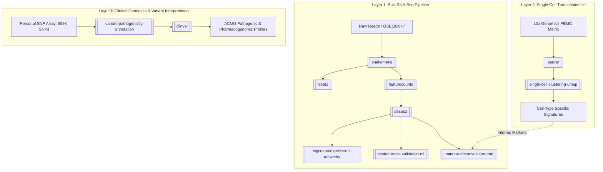

# Multi-Omics and Translational Bioinformatics Ecosystem

## Overview
This repository brings together three distinct but complementary bioinformatics paradigms:
1. **Cohort-Scale Bulk Transcriptomics** (Bulk RNA-Seq: QC $\to$ Spliced Alignment $\to$ DESeq2 $\to$ WGCNA $\to$ Nested CV Random Forest $\to$ Immune Deconvolution).
2. **Single-Cell Resolution Genomics** (scRNA-Seq: Seurat $\to$ Mitochondrial QC $\to$ VST Variable Features $\to$ SNN/Louvain $\to$ UMAP).
3. **Translational Clinical Genomics** (Personal SNP Microarrays $\to$ Hash Matching $\to$ NIH ClinVar $\to$ ACMG Classification & Pharmacogenomics).

## Cross-Layer Synergies
- **Digital Pathology & Single-Cell Ground Truth**: The cell-type marker panels used in bulk TME deconvolution ([[immune-deconvolution-tme]]) are defined and validated by single-cell transcriptomic profiles ([[single-cell-clustering-umap]]).
- **Biomarker Discovery & Target Validation**: Top hub genes identified in bulk co-expression networks (e.g., *AKT1* in [[triple-negative-breast-cancer]]) can be cross-referenced with germline risk variants in [[clinvar]].

## Related Wiki Pages
- [[transcriptomic-analysis-framework]]
- [[bulk-rnaseq-snakemake-pipeline]]
- [[tnbc-analytics-suite]]
- [[single-cell-seurat-workflow]]
- [[clinical-genomics-pipeline]]
